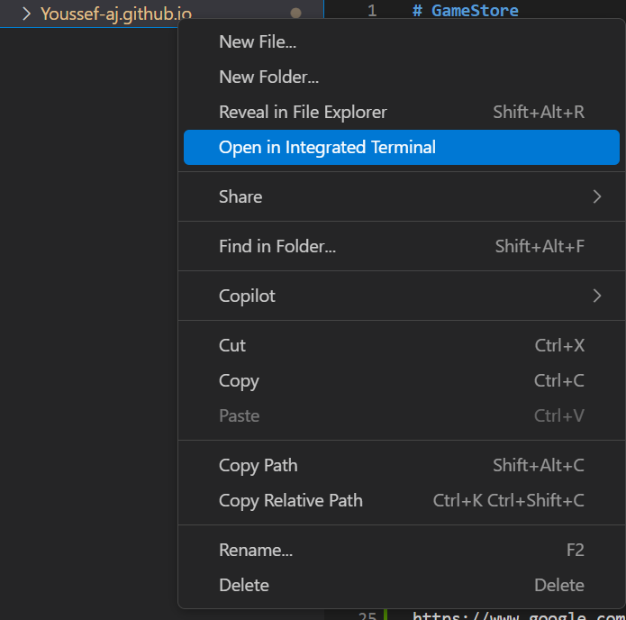
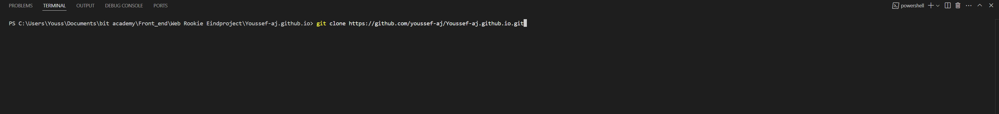
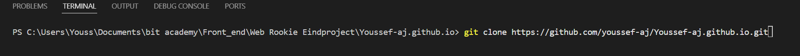

# 📖 Beschrijving

GameStore is een game webshop die ik heb gemaakt voor een schoolproject waarbij ik gebruik heb gemaakt van HTML, het bootstrap framwork, JavaScript en CSS. Dingen die je gaat zien in de webshop:

- Werkend winkelmandje
- Werkende zoekbalk

 
 

# 💡Instalattion guide:
1. **Clone de repository**: Navigeer met je CLI naar de locatie waar je dit project neer wilt zetten, en run het commando `git clone https://github.com/youssef-aj/Youssef-aj.github.io.git`.

2. Je kan nu de website openen door het index.html bestand te openen.

 
 

# Dependencies

Dit project heeft geen dependencies die geinstalleerd moeten worden nadat je deze repository hebt gecloned. BootstrapCSS wordt geinstalleerd via CDN dus het is niet nodig om deze via NPM te installeren.

 
 

# Credtis
 [Lucan Wienen](https://github.com/LABA-LUCAS) heeft mijn geholpen met het implementeren van localstorage

 [Son van der Burg](https://vdburg.site/) heeft mijn geholpen met het verbeteren/verkorte van me code

 
 

# About me
### Mijn naam is Youssef Ajari en ik ben een software developer. je kan mijn vinden op:
- [Instagram](https://www.instagram.com/youssef17.aj/)
- [Linkedin](https://www.linkedin.com/in/youssef-ajari-75156a334/)

 
 

# stappenplan
Ik heb de website [trello](https://trello.com/nl) gebruikt om mijn website te bouwen. Wat is trello? trello is een veelgebruikte visuele tool voor werkbeheer die teams helpt bij het plannen, organiseren en volgen van projecten en taken.
### dit is de stappen plan die ik heb gebruikt:

 
 

# design
ik heb de webiste [figma](https://www.figma.com/login) gebruikt om een schets te maken van mijn website om te kijken wat ik het ga maken en welke kleuren ik gebruik en waar ik alles precies wil ik vind het een aanrader om deze website te gebruiken zodat je precies weet wat je wilt en hoe je het wilt
## hier is zijn mijn schetsen die ik heb gebruikt:
### home pagina:

### discover pagina:

### footer:
